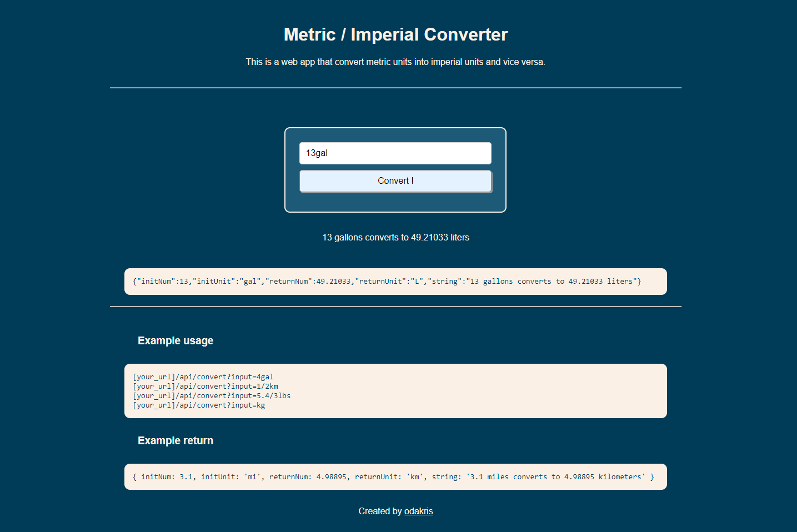

# FCC - Exercise Tracker


Live demo of **[Metric / Imperial Converter](https://boilerplate-project-metricimpconverter.odakris.repl.co/)**

## Description

This is the boilerplate for the Metric-Imperial Converter project. Instructions for building your project can be found at https://www.freecodecamp.org/learn/quality-assurance/quality-assurance-projects/metric-imperial-converter

This project is part of the **[freeCodeCamp](https://www.freecodecamp.org/learn/quality-assurance/)** Quality Assurance projects certification.

<p align="center">
  
</p>

## Instructions

Clone this repository and install the NPM packages:

```
npm install
```

In the project directory, run the following script:

```
npm start
```

Open [http://localhost:3000](http://localhost:3000) to view it in the browser.